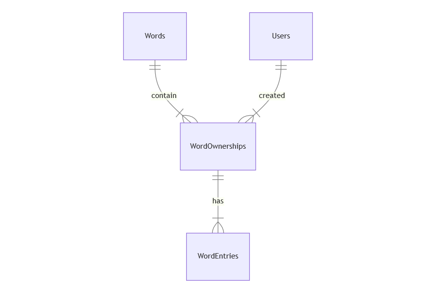

# Design Document

By Phuong Anh Vu

## Scope

This database includes all entities necessary user can create a new vocabulary and seamlessly manage them. As such, included in the database's scope is:

* Users, including basic identifying information such as first name, last name, email, and password.
* Words, including only word's name
* WordOwnerships, including the time at which the user was added, word's id, and user's id
* WordEntries, including the relatiship with WordsOwnerships and the type of that word such as 'noun', 'verb', 'adjective', 'adverb', etc. and word's sentence example.

Out of scope are elements like user cannot share their vocabulary resources to other user.

## Functional Requirements

This database will support:

* CRUD operations for word's name and word entry
* Getting the vocabulary list that sorted by alphabet or month and year.

## Representation

Entities are captured in MySQL tables with the following schema.

### Entities

The database includes the following entities:

#### Users

The `users` table includes:

* `id`, which specifies the unique ID for the user as an `INT`. This column thus has the `PRIMARY KEY` constraint applied.
* `user_name`, which specifies the user's user name as `VARCHAR` and `UNIQUE` attribute.
* `first_name`, which specifies the user's first name as `VARCHAR`, given `VARCHAR` is appropriate for name fields.
* `last_name`, which specifies the user's last name. `VARCHAR` is used for the same reason as `first_name`.
* `password`, which specifies the user's password. `VARCHAR` is used to stored encrypted password.

#### Words

The `words` table includes:

* `id`, which specifies the unique ID for the word as an `INT`. This column thus has the `PRIMARY KEY` constraint applied.
* `name`, which specifies the word's name as `VARCHAR` and `UNIQUE` attribute.

#### Word Ownerships

The `word_ownerships` table includes:

* `id`, which specifies the unique ID for the instructor as an `INT`. This column thus has the `PRIMARY KEY` constraint applied.
* `word_id`, which is the ID of the word which created as an `INT`. This column thus has the `FOREIGN KEY` constraint applied, referencing the `id` column in the `words` table to ensure data integrity.
* `user_id`, which is the ID of the user who made the added as an `INT`. This column thus has the `FOREIGN KEY` constraint applied, referencing the `id` column in the `users` table to ensure data integrity.
* `created`, which specifies when the user created a new word. DATETIME in MySQL can be conveniently stored as `YYYY-MM-DD hh:mm:ss` format. The default value for the `created` attribute is the current date.

All columns in the `word_onwerships` table are required, and hence should have the `NOT NULL` constraint applied. No other constraints are necessary.

#### Word Entries

The `word_entries` table includes:

* `id`, which specifies the unique ID for the submission as an `INT`. This column thus has the `PRIMARY KEY` constraint applied.
* `word_ownership_id`, which is the ID of the word's ownership who made the created as an `INT`. This column thus has the `FOREIGN KEY` constraint applied, referencing the `id` column in the `word_ownerships` table to ensure data integrity.
* `type`, which is one of the selection from a list as an `ENUM` type. I choose a `VARCHAR` for the word entry type because types will on the list of 'noun', 'verb', 'adjective', and 'adverb'. I also use column constraints `UNIQUE` and `NOT NULL`.
* `definition`, which is the difinition of the word as `VARCHAR`
* `example`, which is their own example sentence of each word entry as `VARCHAR`.

### Relationships

The below entity relationship diagram describes the relationships among the entities in the database.

As detailed by the diagram:

* One word has many word ownerships. For example: one word could have many user who created with the same word's name.
* One user can create many words which will store in word onwership table.
* Each word onwer ships could have more than 1 word entry including word's type and example sentence.

## Optimizations

Per the typical queries in `queries.sql`, it is common for users of the database to access all words created by any particular user. For that reason, indexes are created on the `first_name`, `last_name`, and `username` columns to speed the identification of students by those columns.

## Limitations

The current schema assumes individual user. Collaborative word entries would require a shift to a many-to-many relationship between users and word_entries.
